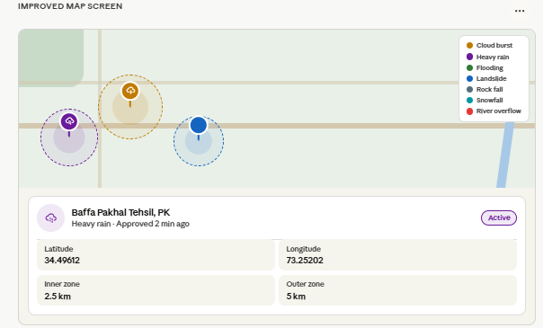
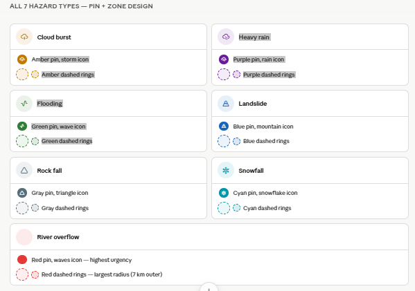
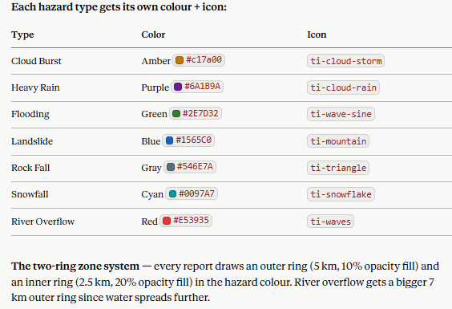

# CloudBurst Alert

<p align="center">
  <strong>A Flutter-based cloudburst risk monitoring and incident reporting app for localized disaster awareness.</strong>
</p>

<p align="center">
  
  
  
  
</p>

CloudBurst Alert is a mobile application built to help users understand short-term cloudburst and heavy-rain risk around their location. It combines live weather data, device location, OpenStreetMap visualization, a custom risk-scoring algorithm, and crowdsourced incident reporting through Supabase.

The project is designed for disaster-prone regions where fast, local, and easy-to-submit reports can support better situational awareness.

---

## Preview

<p align="center">
  
  
  
</p>

---

## What The App Does

- Shows live weather conditions for the selected or detected location.
- Calculates a local cloudburst risk score using rainfall probability, cloud cover, humidity, wind speed, and pressure.
- Classifies risk as `LOW RISK`, `MODERATE RISK`, or `HIGH RISK`.
- Displays current temperature, rain chance, humidity, wind, and upcoming forecast conditions.
- Lets users search supported cities such as Islamabad, Rawalpindi, Lahore, Karachi, Murree, Gilgit, and Skardu.
- Provides an interactive map where users can tap any location to analyze the risk zone.
- Draws visual hotspot circles for exact analysis areas and wider affected zones.
- Shows approved public reports as live warning markers on the map.
- Allows users to submit incident reports with type, intensity, notes, GPS coordinates, and optional camera photo evidence.
- Stores reports, images, and device location data in Supabase.
- Tracks each user's own reports through an anonymous device ID.
- Displays notification badges for new approved alerts and report status updates.

---

## Core Features

### Local Risk Dashboard

The home screen fetches live forecast and current weather data from OpenWeather, then converts it into a simple, readable risk status. Users can quickly see whether the current environment is stable or needs attention.

### Interactive Risk Map

The map screen uses `flutter_map` with OpenStreetMap tiles. Users can tap any location and the app analyzes that exact point using live forecast data. The app then renders:

- exact analysis zone
- wider affected zone
- confidence meter
- rain chance
- nearby approved incident reports

### Incident Reporting

Users can submit disaster observations without account friction. Report types include:

- Cloud Burst
- Heavy Rain
- Flooding
- Landslide
- Rock Falling
- Snowfall
- River Overflow

Each report can include intensity, notes, coordinates, location name, and an optional camera image.

### Realtime Alerts

Approved reports from Supabase are streamed back into the app and shown as active alerts. This creates a feedback loop where verified reports can become warnings for other users.

### Anonymous Device Identity

The app uses a generated device ID instead of requiring full user authentication. This keeps emergency reporting fast while still allowing users to view their own report history.

---

## Tech Stack

| Layer | Technology |
| --- | --- |
| App framework | Flutter |
| Language | Dart |
| State management | Custom `InheritedNotifier` app state |
| Weather data | OpenWeather Forecast, Current Weather, and Geocoding APIs |
| Maps | `flutter_map`, OpenStreetMap, `latlong2` |
| Location | `geolocator`, `geocoding` |
| Backend | Supabase |
| Database | Supabase PostgreSQL |
| Realtime updates | Supabase realtime streams |
| Storage | Supabase Storage |
| Local persistence | `shared_preferences` |
| Media capture | `image_picker` |

---

## Project Structure

```text
lib/
  app/
    app.dart                  # MaterialApp, routes, app state scope
    navigation/               # Bottom navigation metadata
    routing/                  # Route constants
    state/                    # Shared app state
    theme/                    # App theme
  core/
    services/
      device_service.dart     # Anonymous device ID
      location_service.dart   # GPS permission and current position
      prediction_service.dart # Cloudburst risk algorithm
      supabase_service.dart   # Reports, storage, realtime streams
      weather_service.dart    # OpenWeather API calls
  features/
    alerts/                   # Approved report alerts
    auth/                     # Login/signup screens, currently not wired
    home/                     # Live risk dashboard
    location/                 # Permission and city selection
    map/                      # Interactive risk map
    profile/                  # Menu, user reports, app info
    reports/                  # Incident submission and report history
    shell/                    # Main tab shell
    splash/                   # Startup flow
  shared/
    widgets/                  # Reusable UI components
```

---

## Risk Prediction Logic

The app uses a lightweight heuristic model in `PredictionService`. It reads the first forecast item and computes confidence from:

| Signal | Weight |
| --- | ---: |
| Rain probability | 50% |
| Cloud cover | 20% |
| Humidity | 10% |
| Wind speed | 10% |
| Low pressure | 10% |

The final confidence score is converted into:

| Confidence | Risk |
| --- | --- |
| `70%` and above | High Risk |
| `40%` to `69%` | Moderate Risk |
| Below `40%` | Low Risk |

This model is intentionally simple and explainable. It is suitable for a final-year project prototype and can be improved later with historical weather data, radar feeds, satellite products, or machine learning.

---

## Backend Data Model

The app expects these Supabase resources:

### `Device_location`

| Column | Purpose |
| --- | --- |
| `device_id` | Anonymous device identifier |
| `latitude` | Device latitude |
| `longitude` | Device longitude |
| `created_at` | UTC insertion time |

### `Report`

| Column | Purpose |
| --- | --- |
| `id` | Primary key |
| `reports_type` | Incident category |
| `discription` | User report details. Existing code uses this spelling. |
| `intensity` | Low, Moderate, or High intensity |
| `location_name` | Human-readable location |
| `latitude` | Incident latitude |
| `longitude` | Incident longitude |
| `status` | `Pending`, `Approved`, or `Rejected` |
| `created_at` | UTC insertion time |
| `device_id` | Anonymous reporter ID |
| `image_url` | Optional public Supabase Storage URL |

### Storage bucket

| Bucket | Purpose |
| --- | --- |
| `image_url` | Stores uploaded report photos |

---

## Getting Started

### Prerequisites

Install the following tools before running the project:

- Flutter SDK with Dart 3 support
- Android Studio or VS Code
- Android SDK and an emulator or physical Android device
- A Supabase project
- An OpenWeather API key

Check your Flutter setup:

```bash
flutter doctor
```

### Clone The Repository

```bash
git clone https://github.com/your-username/cloud_burst.git
cd cloud_burst
```

### Install Packages

```bash
flutter pub get
```

### Configure API Services

Update the service credentials before publishing or running your own deployment:

- Supabase URL and anon key are initialized in `lib/main.dart`.
- OpenWeather API key is currently defined in `lib/core/services/weather_service.dart`.

For production, move these values out of source code and load them through build-time environment variables or a secure configuration process.

### Run The App

```bash
flutter run
```

### Analyze The Code

```bash
flutter analyze
```

### Run Tests

```bash
flutter test
```

---

## Android Permissions

The Android app requests:

- Internet access
- Network state access
- Fine location
- Coarse location
- Background location

Location permission is used to show local alerts, calculate risk for the user's current area, and attach coordinates to reports.

---

## Current Status

Implemented:

- Live weather dashboard
- Custom risk scoring
- Location permission flow
- City search flow
- Interactive OpenStreetMap risk map
- Supabase report submission
- Optional report photo upload
- Realtime approved alerts
- My Reports screen
- Profile menu, About screen, and Help screen

Partially implemented or future work:

- Authentication screens exist but are not currently wired into the route flow.
- Admin dashboard is described in the thesis documentation but is not part of this mobile app source tree.
- The prediction model is heuristic-based and should not be treated as an official emergency forecast.
- API keys should be externalized before public production use.

---

## Roadmap

- Add a dedicated admin dashboard for approving and rejecting public reports.
- Replace hardcoded credentials with secure environment configuration.
- Add offline fallback for last known weather and reports.
- Add push notifications for nearby approved high-risk alerts.
- Expand city search to dynamic geocoding instead of a fixed city list.
- Improve prediction accuracy with historical weather and verified incident datasets.
- Add unit tests for `PredictionService`, `WeatherService`, and report parsing.
- Add integration tests for report submission and realtime alert updates.

---

## Important Disclaimer

CloudBurst Alert provides advisory risk information only. It is not an official meteorological warning system. During severe weather, always follow local authorities, emergency services, and official weather agencies.

---

## Author

Developed as a final-year project focused on localized cloudburst prediction, realtime alerts, and citizen-powered incident reporting.

If you use this project as a reference, please keep attribution in your repository.
